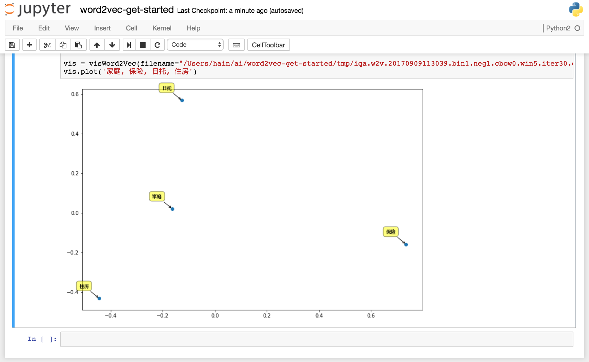

# word2vec-get-started


# Welcome
Fit language model tasks with [word2vec](https://code.google.com/archive/p/word2vec) and [insuranceqa-corpus](https://github.com/Samurais/insuranceqa-corpus-zh).


## Install
```
scripts/compile.sh # verified on Ubuntu 16.04
source ./env.sh
word2vec # for verify
```

## Train
```
cp localrc.sample localrc # modify keys
scripts/train.sh
```

## Get similarities
Post training, a model file is generated in ```tmp```, use ```distance``` to get similarities for words.

```
$ src/distance tmp/iqa.w2v.20170909113039.bin1.neg1.cbow0.win5.iter30.embed100.thr30
Enter word or sentence (EXIT to break): 家庭

Word: 家庭  Position in vocabulary: 83

                                              Word       Cosine distance
------------------------------------------------------------------------
                                            日托                0.648058
                                            住房                0.645767
                                            初创                0.631415
                                            宝石                0.621161
                                            家务                0.612938              
```

> To compute all distances, use ```scripts/dist-analysis.sh MODEL_FILE```

## [Principal component analysis(PCA)](https://en.wikipedia.org/wiki/Principal_component_analysis)

* deps

[Jupyter Notebook](http://jupyter-notebook.readthedocs.io/en/latest/notebook.html)

### Install
```
cd tools/word2vec_boostpy
python setup.py install
pip install -U numpy matplotlib scipy scikit-learn ipython jupyter 
```

### Run
```
./scripts/pca.sh
```

### Demo
open ```http://localhost:8888/notebooks/word2vec-get-started.ipynb```



## iqabot.v2
First, run ElasticSearch Service and Hanlp-api Service with [elasticsearch-get-started](https://github.com/Samurais/elasticsearch-get-started).

```
cd iqabot.v2
cp config.sample.py config.py
python bot.py --query="为什么要获得医疗保险补充保险"
```


# License
[Apache 2.0](./LICENSE)

# Trouble Shooting

1. compile error on Ubuntu
install build essentials
```
sudo apt-get install build-essential
```